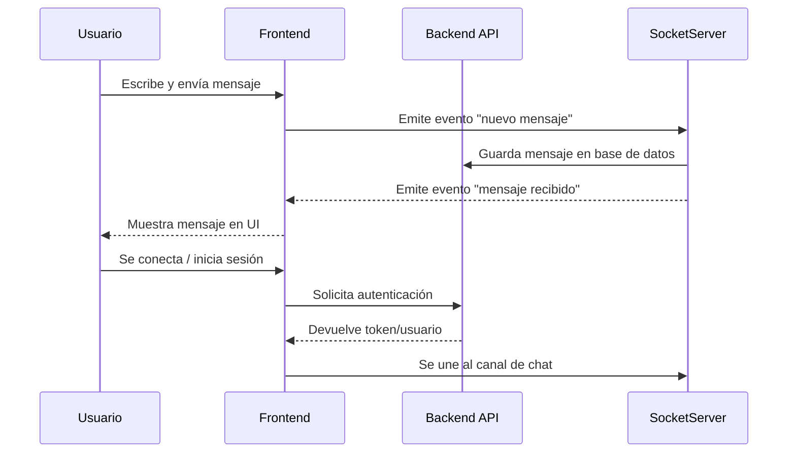

# Chat Frontend

Este proyecto es un **chat en tiempo real** desarrollado con **React** y **Vite**. Permite a los usuarios enviar y recibir mensajes instantáneamente, integrándose con servicios backend para la gestión de usuarios y mensajes.

## Tecnologías utilizadas

- [React](https://react.dev/) — Librería principal para la UI.
- [Vite](https://vitejs.dev/) — Herramienta de desarrollo y bundler.
- [Socket.IO](https://socket.io/) — Comunicación en tiempo real.
- [Axios](https://axios-http.com/) — Cliente HTTP para APIs REST.
- [React Router](https://reactrouter.com/) — Navegación entre vistas.
- [Tailwind CSS](https://tailwindcss.com/) — Estilos utilitarios (opcional, según configuración).

## Estructura de carpetas

```
/src
  /components      # Componentes reutilizables (ChatBox, MessageList, UserList, etc.)
  /pages           # Vistas principales (Home, ChatRoom, Login, etc.)
  /services        # Lógica de conexión a APIs y sockets
  /hooks           # Custom hooks (useChat, useAuth, etc.)
  /utils           # Utilidades y helpers
  /assets          # Imágenes, íconos, etc.
  main.jsx         # Entry point de la app
  App.jsx          # Componente raíz
```

## Decisiones técnicas

- **React + Vite**: Vite ofrece recarga rápida y configuración mínima.
- **Socket.IO**: Permite comunicación bidireccional eficiente para mensajes en tiempo real.
- **Separación de lógica**: Hooks personalizados para manejar autenticación y chat.
- **Componentización**: UI dividida en componentes pequeños y reutilizables.
- **Gestión de estado**: Uso de hooks y contexto para compartir estado global (usuarios, mensajes).

## Flujo de datos



## Cómo ejecutar

```bash
npm install
npm run dev
```

## Personalización

- Configura la URL del backend y del servidor de sockets en `/src/services/`.
- Agrega nuevos componentes en `/src/components/` según necesidades.

---

¡Contribuciones y sugerencias son bienvenidas!